# OnlyOne Authentication System - Visual Diagrams

This document contains visual diagrams showing the inputs, outputs, and data flow of the authentication system.

---

## System Architecture Diagram

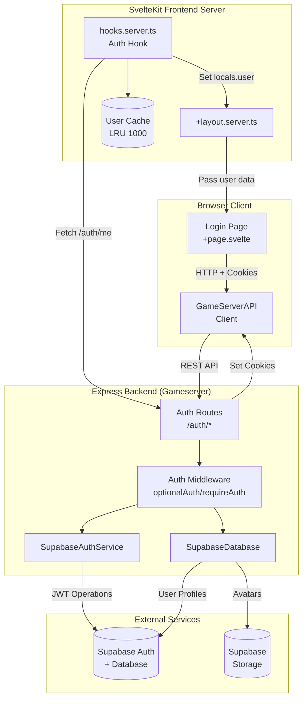

---

## Authentication Flow - Complete Data Flow

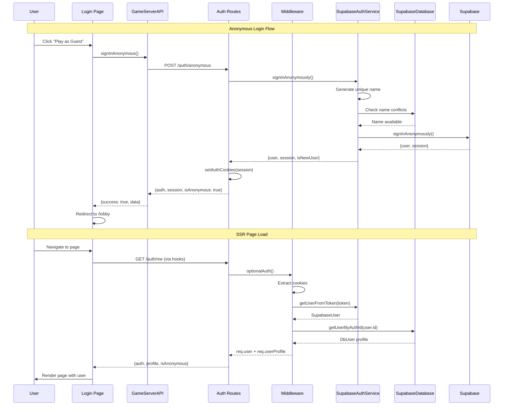

---

## Input/Output Diagram by Component

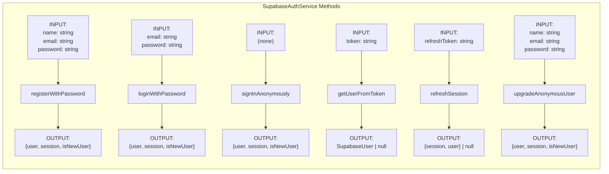

---

## Middleware Flow Diagram

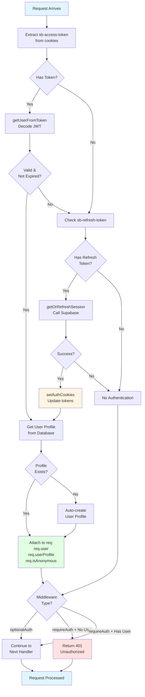

---

## API Endpoints Input/Output Map

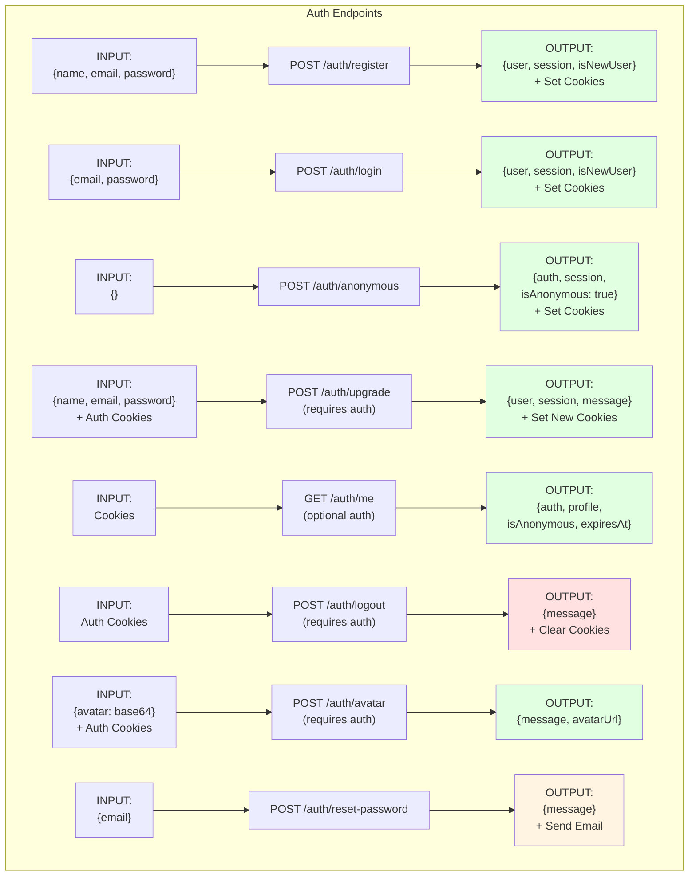

---

## Token Refresh Flow Detail

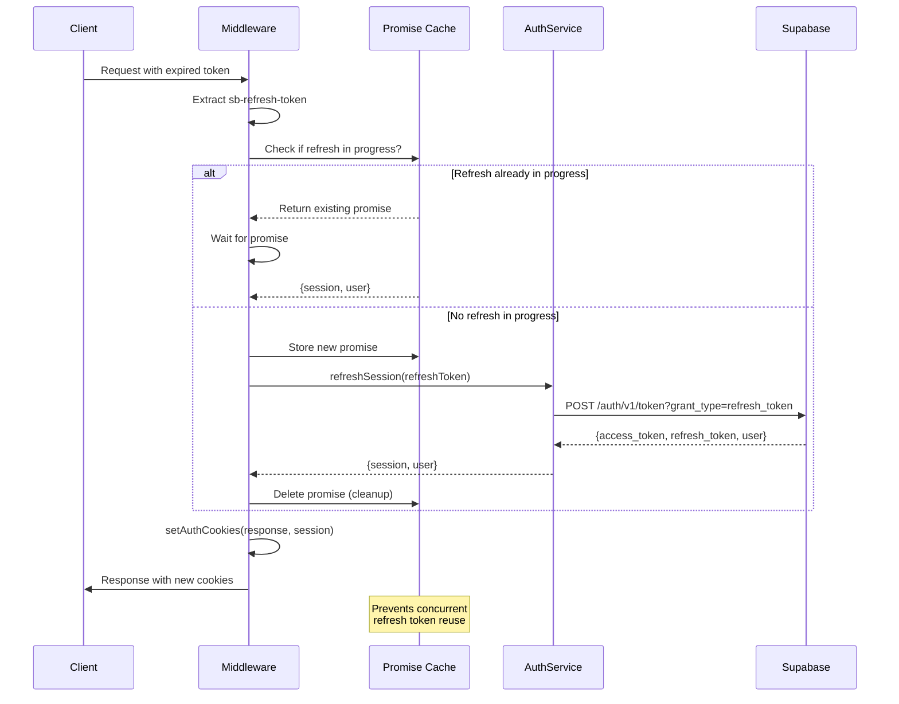

---

## SSR Cache Strategy

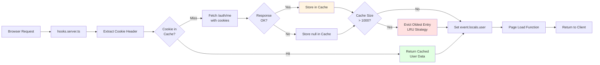

---

## Data Type Relationships

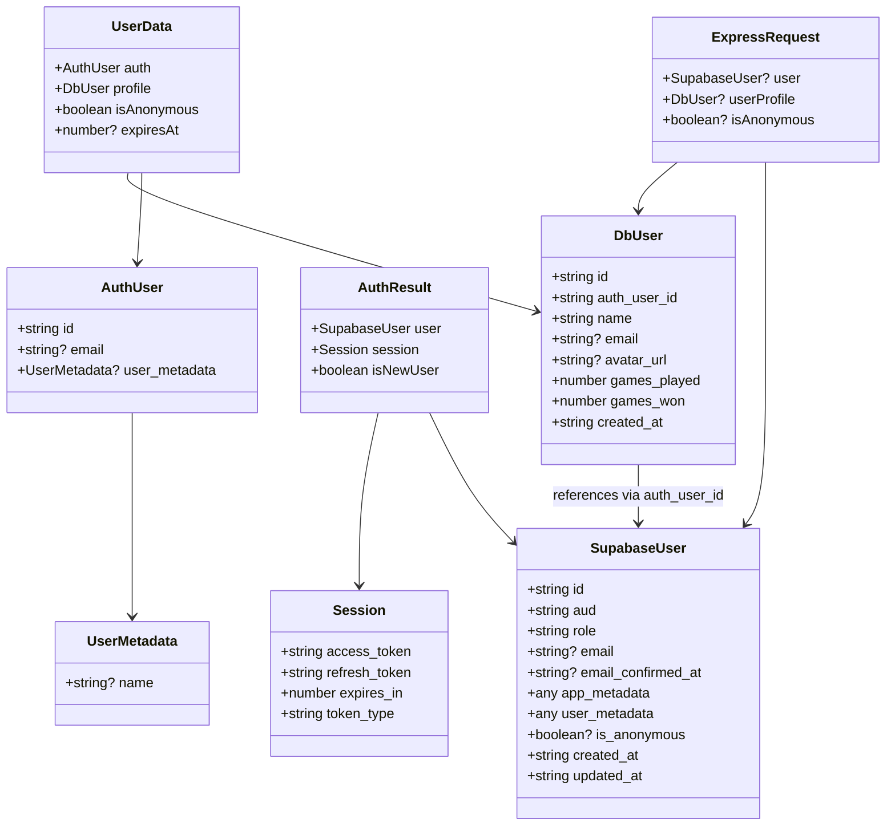

---

## Cookie Flow Diagram

```mermaid
flowchart TD
    subgraph "Authentication Success"
        Auth[User Authenticates] --> SetCookies[setAuthCookies]
        SetCookies --> Access[Set sb-access-token<br/>httpOnly, secure, sameSite: lax<br/>expires: session.expires_in]
        SetCookies --> Refresh[Set sb-refresh-token<br/>httpOnly, secure, sameSite: lax<br/>maxAge: 7 days]
    end

    subgraph "Subsequent Requests"
        Request[Browser Request] --> SendCookies[Browser Auto-sends<br/>Cookies]
        SendCookies --> Middleware[Auth Middleware]
        Middleware --> ValidateAccess[Validate Access Token]
        ValidateAccess --> Expired{Expired?}
        Expired -->|Yes| UseRefresh[Use Refresh Token]
        Expired -->|No| Authenticated[Continue Authenticated]
        UseRefresh --> NewTokens[Get New Tokens<br/>from Supabase]
        NewTokens --> UpdateCookies[Update Both Cookies]
        UpdateCookies --> Authenticated
    end

    subgraph "Logout"
        LogoutReq[Logout Request] --> ClearCookies[clearAuthCookies]
        ClearCookies --> RemoveAccess[Clear sb-access-token]
        ClearCookies --> RemoveRefresh[Clear sb-refresh-token]
        RemoveAccess --> Unauthenticated[User Logged Out]
        RemoveRefresh --> Unauthenticated
    end

    style Access fill:#e1ffe1
    style Refresh fill:#e1ffe1
    style Authenticated fill:#e1ffe1
    style UpdateCookies fill:#fff4e1
    style Unauthenticated fill:#ffe1e1
```

---

## Frontend Client Auto-Retry Logic

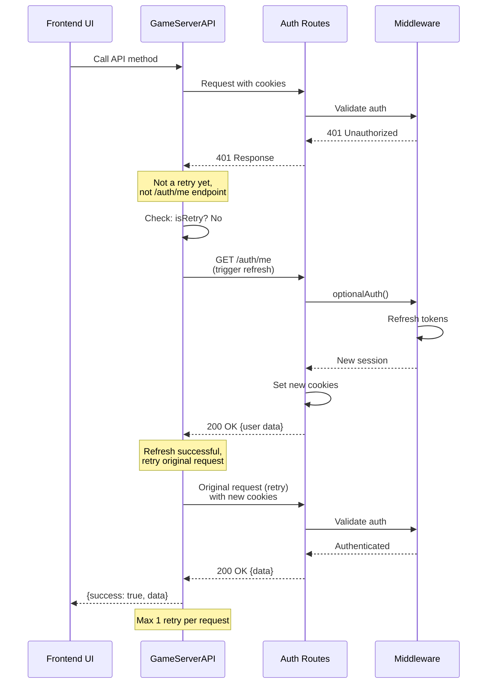

---

## Account Upgrade Flow Detailed

```mermaid
graph TD
    Start[Anonymous User] --> UI[Click Upgrade Account]
    UI --> Form[Fill Form:<br/>name, email, password]
    Form --> Submit[Submit Form]
    Submit --> API[gameServerAPI.upgradeAccount]
    API --> Route[POST /auth/upgrade<br/>with cookies]
    Route --> MW[requireAuth Middleware]

    MW --> CheckAuth{Authenticated?}
    CheckAuth -->|No| Return401[401 Unauthorized]
    CheckAuth -->|Yes| CheckAnon{Is Anonymous?}

    CheckAnon -->|No| Return400[400 Bad Request:<br/>Only anonymous users<br/>can upgrade]
    CheckAnon -->|Yes| UpgradeAuth[SupabaseAuthService<br/>upgradeAnonymousUser]

    UpgradeAuth --> UpdateSupabase[Supabase updateUser:<br/>Set email, password,<br/>user_metadata.name]
    UpdateSupabase --> GetSession[Get new session]
    GetSession --> UpdateDB[Database:<br/>updateUserEmail]
    UpdateDB --> SetCookies[setAuthCookies<br/>with new session]
    SetCookies --> Success[200 OK:<br/>{user, session, message}]
    Success --> Redirect[Frontend:<br/>User now permanent]

    Return401 --> Error[Show Error]
    Return400 --> Error

    style Start fill:#e1f5ff
    style Success fill:#e1ffe1
    style Redirect fill:#e1ffe1
    style Return401 fill:#ffe1e1
    style Return400 fill:#ffe1e1
    style Error fill:#ffe1e1
```

---

## Security Layers Diagram

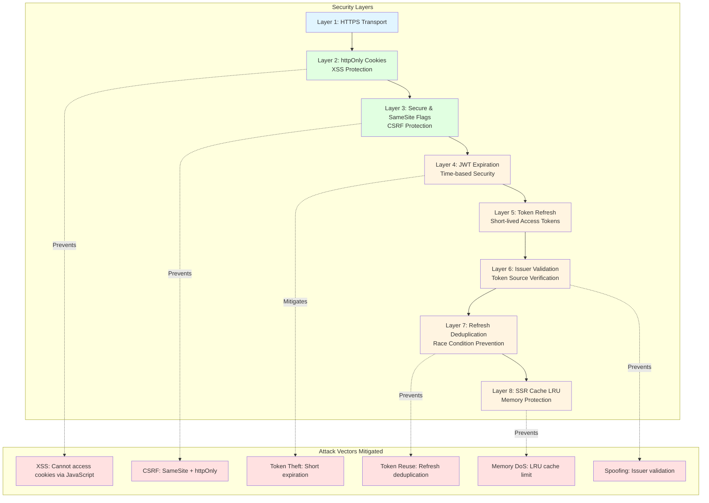

---

## Complete User Journey Map

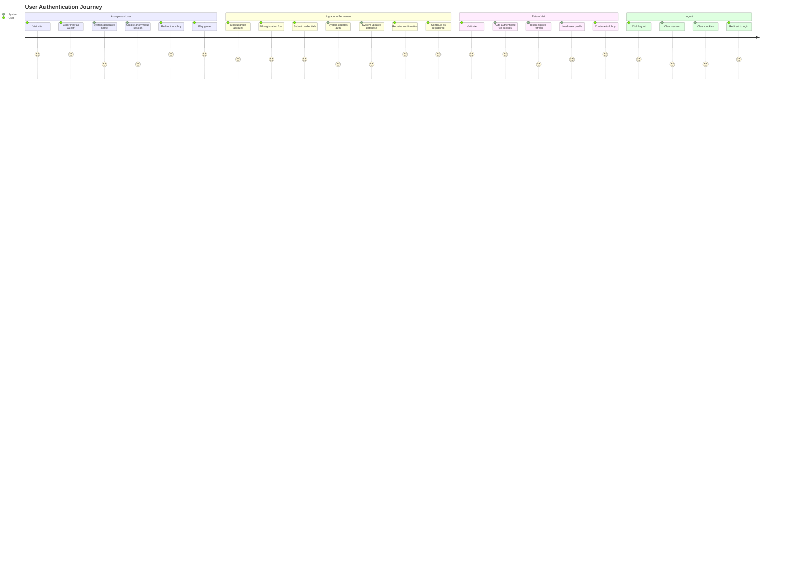

---

## Environment Variables Flow

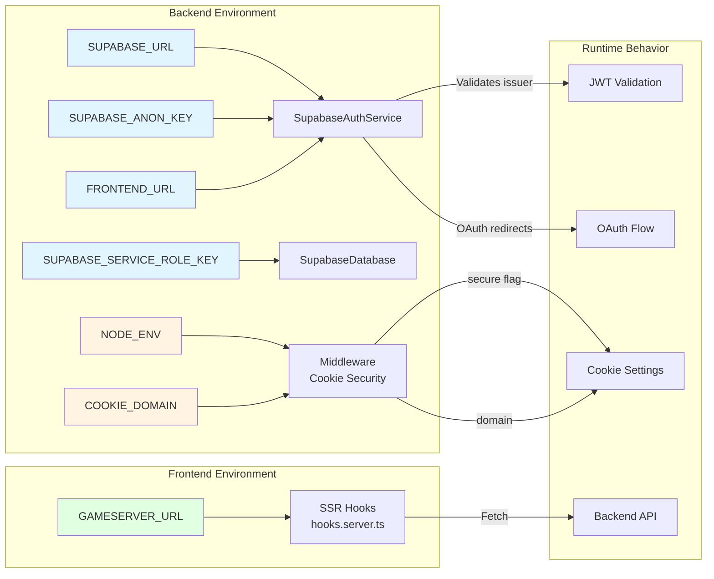

---

## Notes

### Diagram Legend

- **Blue boxes**: Entry points / Initial state
- **Green boxes**: Successful outcomes
- **Yellow boxes**: Processing / Intermediate state
- **Red boxes**: Errors / Failure states
- **Solid arrows**: Data flow
- **Dashed arrows**: Relationships / Prevents

### How to View These Diagrams

These diagrams use Mermaid syntax and can be viewed in:

1. **GitHub** - Renders automatically in markdown files
2. **VS Code** - Install "Markdown Preview Mermaid Support" extension
3. **Mermaid Live Editor** - Copy/paste at https://mermaid.live
4. **Documentation sites** - Most modern doc platforms support Mermaid

### Key Insights from Diagrams

1. **Token Flow**: Access tokens are short-lived, refresh tokens last 7 days
2. **Automatic Refresh**: Both middleware and frontend client auto-refresh expired tokens
3. **Cache Strategy**: SSR uses LRU cache to reduce backend calls
4. **Security Layers**: Multiple overlapping security mechanisms
5. **Anonymous Flow**: Unique name generation with conflict detection
6. **Upgrade Path**: Anonymous users can convert to permanent accounts
7. **Auto-Retry**: Frontend automatically retries failed requests after token refresh
